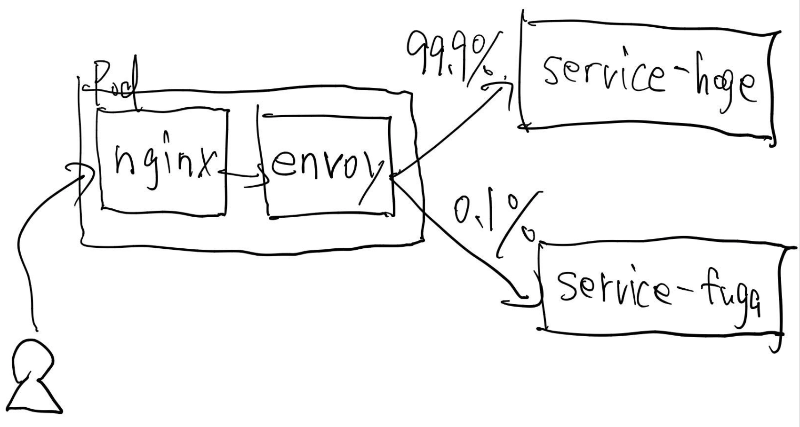

## Traffic splitting example using Nginx and Envoy



### Try it

```
# Deploy to Kubernetes
$ kubectl create ns traffic-splitting
$ kustomize build manifests | kubectl apply -f - -n traffic-splitting

# Expose
$ kubectl port-forward service/nginx -n traffic-splitting 4567:80
```

Send traffic using [ntimes](https://github.com/yuya-takeyama/ntimes) and curl

```
$ ntimes 10000 -p 12 -- curl -s http://localhost:4567 | sort | uniq -c
   9 This is Fuga Service!
9991 This is Hoge Service!
```
